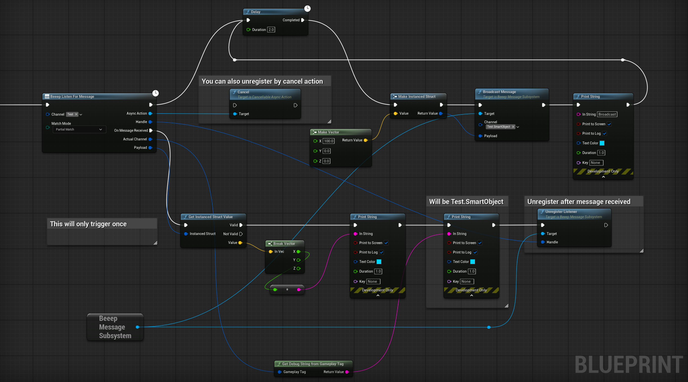

# Beeep Message Bus Unreal Engine

This plugin is inspired by the [GameplayMessageRouter](https://github.com/EpicGames/UnrealEngine/tree/release/Samples/Games/Lyra/Plugins/GameplayMessageRouter) in the Lyra project, with some enhanced functionality.

In the original `GameplayMessageRouter`, you cannot synchronously unregister a listener while receiving a message because it would result in removing elements during array iteration.

This plugin solves this issue by implementing a `MarkDead` approach.

### Example
